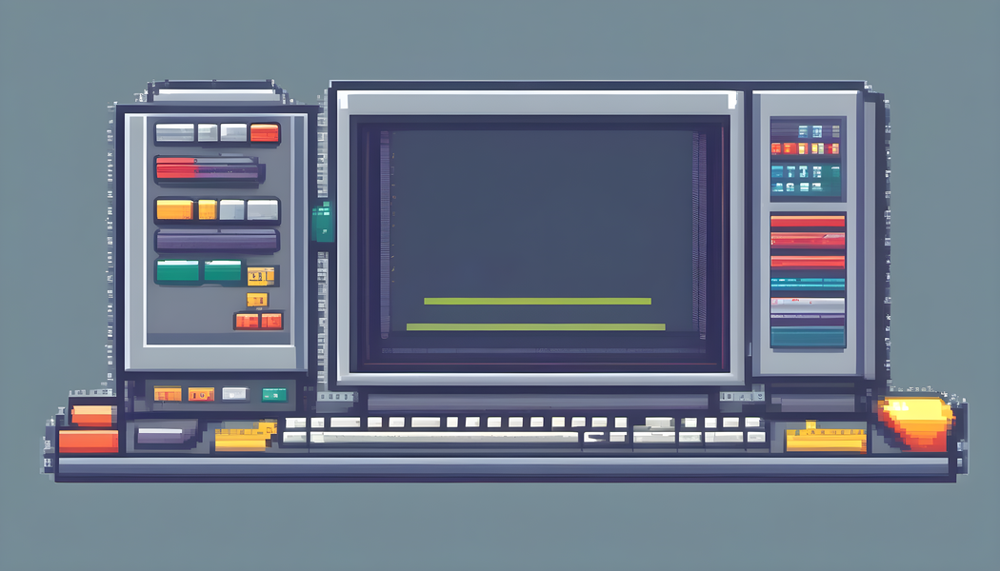

# terminal-line

Prints a line across the terminal



## Installation

```shel
# Using Yarn
yarn add @agirorn/terminal-line

# Using npm
npm install @agirorn/terminal-line
```

## Usage

```shel
yarn -s terminal-line
-----------------------------------------------------------
```
